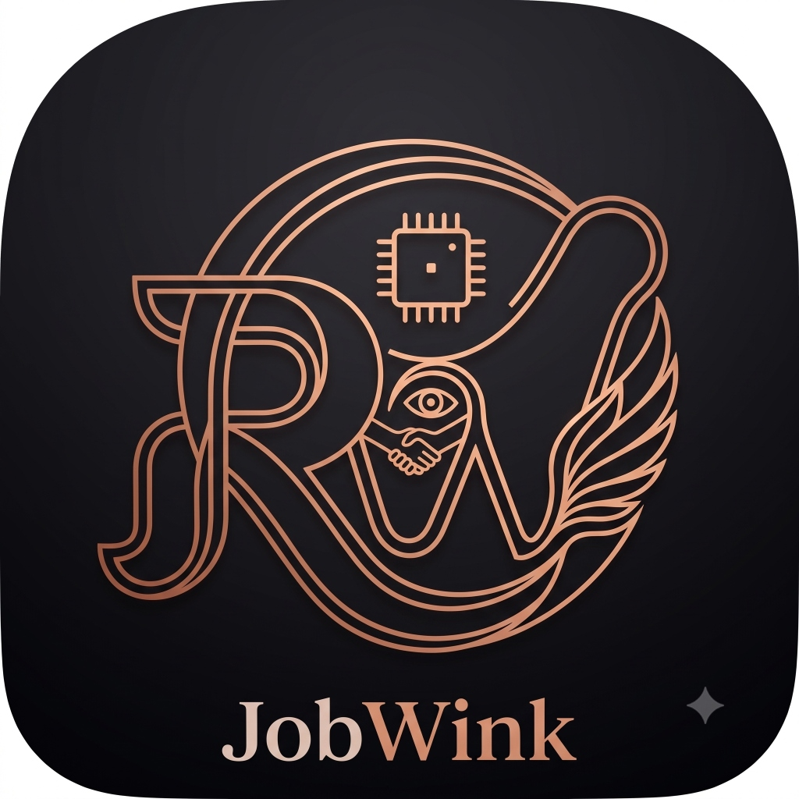

<div align="center">

#  JobWink

### *Your AI-Powered Career Intelligence Platform*

[](https://flutter.dev)
[](https://dart.dev)
[](https://supabase.com)
[](https://fastapi.tiangolo.com)
[](LICENSE)

> **JobWink** is an intelligent, full-stack Flutter web application that supercharges your job search — from AI-crafted resumes and real-time ATS scoring to Tinder-style job matching and ML-powered career predictions.

[🚀 Features](#-features) · [🏗️ Architecture](#-architecture) · [⚙️ Setup](#️-setup) · [🤖 AI Providers](#-ai-providers) · [🗂️ Project Structure](#️-project-structure) · [🛠️ Backend](#️-backend-api-reference)

---

</div>

## 🌟 What is JobWink?

JobWink transforms the painful, manual job hunt into a seamless, AI-driven experience. It combines a **beautiful Flutter web UI**, a **Python FastAPI backend**, a **job intelligence collector**, and a **multi-provider AI orchestration layer** to give job seekers an unfair advantage.

Whether you're tailoring your resume for a specific role, checking your ATS match score, swiping through curated job listings, or predicting your salary — JobWink has you covered.

---

## 🚀 Features

### 📝 Smart Resume Editor
- **AI-Powered Resume Builder** — Build a professional resume from scratch or upload an existing PDF/DOCX and let AI parse and populate every section
- **Multiple Resume Types** — Generate targeted resumes: *Experience-focused*, *Skills-focused*, *Fresher/Graduate*, and more
- **GitHub Import** — Automatically pull your project descriptions from your GitHub profile
- **Section-Level Editing** — Edit Personal Info, Summary, Skills, Experience, Education, Projects, Certifications, and Custom sections independently
- **Live PDF Preview** — See your polished resume render in real time as you type
- **One-Click PDF Export** — Download a pixel-perfect, print-ready PDF with proper fonts and Unicode support
- **Resume History** — All your saved resumes are stored in Supabase; revisit, re-download, or fork any version

### 🎯 ATS Score Engine
- **Real-Time ATS Scoring** — Paste a Job Description and instantly see your match percentage on an animated circular gauge
- **Keyword Intelligence** — The `JdKeywordEngine` classifies hundreds of technical and soft-skill keywords into *High*, *Medium*, and *Low* priority buckets
- **Color-Coded Highlighting** — Matched keywords glow in your resume preview; missing keywords appear in a dedicated gap list with suggestions
- **Debounced Live Analysis** — JD analysis fires automatically as you type, with smart debouncing to avoid excessive API calls

### 💼 Swipe Job Matcher *(Tinder for Jobs)*
- **Card-Based UI** — Swipe right to save a job, left to pass, with smooth spring-physics animations
- **Smart Job Queue** — Jobs are sourced and ranked by AI match percentage against your resume
- **Saved & Passed Stacks** — Review all your swipe decisions and apply directly from the saved stack
- **One-Click Apply** — Opens the job source URL directly (LinkedIn, Wellfound, Indeed, etc.)

### 🔮 Job Prediction Engine
- **ML Salary Prediction** — Feed in your resume data and a job description to get a predicted salary range with confidence intervals
- **Feature Extraction** — AI extracts structured features (skills, certifications, education, YoE, project count) directly from your resume
- **Editable Feature Panel** — Review and correct the extracted features before running the prediction model
- **Prediction Breakdown** — See exactly which features drove the salary estimate

### 📊 Application Tracker
- **Kanban-Style Pipeline** — Track every application across *Saved → Applied → Interviewing → Offer* stages
- **Match Score Badges** — Each tracked job shows its AI match percentage at a glance
- **Status Transitions** — Move applications between stages with a single tap

### 🗂️ Resume History & Versioning
- **Cloud Persistence** — Every resume export is logged in Supabase with a timestamp, template type, and ATS score snapshot
- **Re-Download Anywhere** — Re-generate any historical resume as a fresh PDF at any time
- **Download Quota System** — Fair daily limits per user, managed server-side with admin override capabilities

### 🛡️ Admin Dashboard
- **User Overview** — See total users, DAUs, resumes generated today, and users at quota limit
- **Per-User Quota Control** — Search any user and manually adjust their daily download limits
- **Paginated User Table** — Browse all registered users with real-time search filtering

### 🎨 Landing Page
- **Animated Hero Section** — Full-screen hero with gradient text and Lenis smooth-scroll
- **Feature Showcase** — Animated cards highlighting every major feature
- **Product Preview** — Live screenshots of the app embedded in the landing page
- **AI Intelligence Section** — Visual breakdown of the multi-provider AI stack
- **CTA Form** — Email capture with backend integration for early access signups

### 🌗 Theme & UX
- **Dark / Light Mode** — System-aware theme with manual toggle; preference persisted across sessions
- **Cookie Consent** — GDPR-compliant cookie consent banner with granular controls
- **Smooth Animations** — Page transitions, Lenis scroll, and micro-animations throughout
- **Responsive Layout** — Collapsible sidebar, adaptive nav bar, mobile-aware breakpoints

---

## 🏗️ Architecture

```
┌─────────────────────────────────────────────────────────────┐
│                    Flutter Web App (Dart)                    │
│  Landing Page → Auth → Dashboard → Resume Editor → ...      │
│                                                             │
│  ┌────────────┐  ┌──────────────┐  ┌──────────────────────┐│
│  │ AI Service │  │ JD Keyword   │  │  Resume Export       ││
│  │ (Orchestr.)│  │ Engine       │  │  Service (PDF/DOCX)  ││
│  └─────┬──────┘  └──────────────┘  └──────────────────────┘│
└────────┼────────────────────────────────────────────────────┘
         │ Multi-provider failover
         ▼
┌─────────────────────────────────────────────────────────────┐
│                    AI Provider Layer                         │
│  Primary: Gemini 2.5 Flash/Pro                              │
│  Fallback: Groq → OpenAI → xAI (Grok) → NVIDIA Nemotron    │
│  Specialized: Cerebras · Mistral · HuggingFace              │
└─────────────────────────────────────────────────────────────┘
         │
         ▼
┌─────────────────────────────────────────────────────────────┐
│               Python FastAPI Backend                         │
│  /resume/new · /resume/upload · /resume/{id}/tailor         │
│  /resume/{id}/export · /template/analyze · /job/predict     │
│  Template Analyzer · Template Renderer · Job Predictor      │
└─────────────────────────────────────────────────────────────┘
         │
         ▼
┌─────────────────────────────────────────────────────────────┐
│                    Supabase (PostgreSQL)                      │
│  users · resumes · resume_history · resume_usage_logs        │
│  user_resume_limits · bug_reports · cookie_consent           │
└─────────────────────────────────────────────────────────────┘
         ▲
┌────────┴────────────────────────────────────────────────────┐
│                   Job Collector (Python)                     │
│  Multi-source scrapers → Deduplication → Normalization       │
│  → Supabase DB sync                                          │
└─────────────────────────────────────────────────────────────┘
```

---

## 🤖 AI Providers

JobWink uses a **cascading multi-provider AI orchestration** system. If the primary provider hits a quota limit or error, it automatically falls back to the next available provider — zero downtime, zero user impact.

| Priority | Provider | Model | Use Case |
|----------|----------|-------|----------|
| 🥇 Primary | **Google Gemini** | `gemini-2.5-flash` / `gemini-2.5-pro` | Resume parsing, tailoring, ATS analysis |
| 🥈 Fallback 1 | **Groq** | `llama-3.3-70b` | Ultra-fast inference fallback |
| 🥉 Fallback 2 | **OpenAI** | `gpt-4o` | General purpose fallback |
| 4️⃣ Fallback 3 | **xAI (Grok)** | `grok-3` | Secondary fallback |
| 5️⃣ Fallback 4 | **NVIDIA NIM** | `nemotron-70b` | Tertiary fallback |
| ⚡ Specialist | **Cerebras** | `llama3.1-70b` | Ultra-fast 1000+ tokens/sec tasks |
| 🔬 Specialist | **Mistral** | `mistral-large` | European data-residency use cases |
| 🤗 Specialist | **HuggingFace** | Various | Fine-tuned task models |

---

## ⚙️ Setup

### Prerequisites

| Tool | Version | Purpose |
|------|---------|---------|
| Flutter | `≥ 3.x` | Frontend framework |
| Dart | `≥ 3.12.2` | Language |
| Python | `≥ 3.10` | Backend |
| Supabase account | — | Database & Auth |

---

### 1. Clone the Repository

```bash
git clone https://github.com/your-org/jobwink.git
cd jobwink
```

### 2. Configure Environment Variables

Copy the example and fill in your keys:

```bash
cp .env.example .env
```

**`.env` keys:**

```env
# Supabase
SUPABASE_URL=https://your-project.supabase.co
SUPABASE_ANON_KEY=your_anon_key

# AI Providers (add whichever you have)
GEMINI_API_KEY=your_gemini_key
OPENAI_API_KEY=your_openai_key
GROQ_API_KEY=your_groq_key
XAI_API_KEY=your_xai_key
CEREBRAS_API_KEY=your_cerebras_key
MISTRAL_API_KEY=your_mistral_key
NVIDIA_API_KEY=your_nvidia_key
```

### 3. Install Flutter Dependencies

```bash
flutter pub get
```

### 4. Set Up the Python Backend

```bash
cd backend
pip install -r requirements.txt
python backend_main.py
```

The backend runs at `http://127.0.0.1:8000` by default.

### 5. Run the Flutter App

```bash
# Web (recommended)
flutter run -d web-server --web-port 8080

# Chrome
flutter run -d chrome

# Windows desktop
flutter run -d windows
```

---

### 🔄 Auto-Start Backend on Windows

To have the Python backend start silently at system boot:

```powershell
# Run once in PowerShell (as Administrator)
.\install_background_service.ps1
```

This registers `start_backend_silent.vbs` as a Windows Startup shortcut.

---

## 🗂️ Project Structure

```
jobwink/
│
├── lib/                          # Flutter source
│   ├── main.dart                 # App entry point, provider init
│   ├── config/                   # AI keys, limits, backend URLs
│   ├── models/                   # Data models (ResumeData, JobMatch, ...)
│   ├── screens/                  # Full-page screens
│   │   ├── resume_editor_screen.dart     # ⭐ Core resume builder (5700+ lines)
│   │   ├── swipe_matcher_screen.dart     # Tinder-style job matcher
│   │   ├── job_prediction_screen.dart    # ML salary predictor
│   │   ├── dashboard_screen.dart         # User home dashboard
│   │   ├── resume_history_screen.dart    # Saved resume versions
│   │   ├── application_tracker_screen.dart # Job pipeline tracker
│   │   ├── admin_dashboard_screen.dart   # Admin panel
│   │   └── profile_screen.dart           # User profile
│   ├── services/                 # Business logic & API clients
│   │   ├── ai_service.dart              # 🤖 Multi-provider AI orchestrator
│   │   ├── jd_keyword_engine.dart       # 🎯 ATS keyword analysis engine
│   │   ├── resume_export_service.dart   # 📄 PDF/DOCX export
│   │   ├── resume_persistence_service.dart # Cloud save/load
│   │   ├── resume_limit_service.dart    # Quota management
│   │   ├── gemini_service.dart          # Gemini API client
│   │   ├── openai_service.dart          # OpenAI API client
│   │   ├── groq_service.dart            # Groq API client
│   │   ├── cerebras_service.dart        # Cerebras API client
│   │   ├── mistral_service.dart         # Mistral API client
│   │   ├── xai_service.dart             # xAI/Grok API client
│   │   ├── nvidia_service.dart          # NVIDIA NIM client
│   │   ├── github_service.dart          # GitHub project importer
│   │   └── job_service.dart             # Job listings & matching
│   ├── widgets/                  # Reusable UI components
│   │   ├── app_sidebar.dart             # Navigation sidebar
│   │   ├── resume_preview_dialog.dart   # Live PDF preview
│   │   ├── ats_score_gauge.dart         # Circular ATS score widget
│   │   ├── hero_section.dart            # Landing page hero
│   │   ├── features_section.dart        # Feature cards
│   │   └── ...                          # 25+ more widgets
│   ├── animations/               # Lenis scroll, page transitions
│   ├── theme/                    # AppTheme, colors, typography
│   └── providers/                # AuthProvider (Supabase)
│
├── backend/                      # Python FastAPI backend
│   ├── backend_main.py           # 🔧 Main API server (1100+ lines)
│   ├── template_analyzer.py      # PDF template token extractor
│   ├── template_renderer.py      # Resume → PDF renderer
│   ├── job_prediction_service.py # ML salary prediction model
│   └── requirements.txt
│
├── job_collector/                # Autonomous job scraping service
│   ├── main.py                   # Orchestrator
│   ├── collectors/               # Per-source scrapers
│   ├── normalizer/               # Data normalization
│   ├── deduplication/            # Duplicate detection
│   └── database/                 # Supabase sync
│
├── supabase/
│   ├── migrations/               # All DB schema migrations
│   └── database_documentation.md # Full schema reference
│
└── assets/
    ├── fonts/                    # Custom typefaces
    └── images/                   # App images & logo
```

---

## 🛠️ Backend API Reference

The FastAPI backend runs on `http://127.0.0.1:8000`. Key endpoints:

| Method | Endpoint | Description |
|--------|----------|-------------|
| `POST` | `/resume/new` | Create a blank resume |
| `POST` | `/resume/upload` | Upload PDF/DOCX → AI parse into sections |
| `GET` | `/resume/{id}` | Fetch resume sections |
| `PATCH` | `/resume/{id}/section/{name}` | Update a single section |
| `POST` | `/resume/{id}/tailor` | AI-tailor resume to a job description |
| `GET` | `/resume/{id}/export` | Download as `pdf` or `docx` |
| `POST` | `/template/analyze` | Analyze a PDF template's visual design tokens |
| `GET` | `/resume/{id}/render` | Render resume using a design template |
| `POST` | `/job/predict` | ML salary + fit prediction |

---

## 🗃️ Database Schema *(Supabase)*

| Table | Purpose |
|-------|---------|
| `users` | Auth users (managed by Supabase Auth) |
| `resumes` | Master resume records with JSON sections |
| `resume_history` | Versioned export log per user |
| `resume_usage_logs` | Daily generation count tracking |
| `user_resume_limits` | Per-user daily download quota overrides |
| `bug_reports` | In-app bug report submissions |
| `cookie_consent` | GDPR consent records |

---

## 🧪 Testing

The `test/` directory contains **43 Flutter unit & widget tests**:

```bash
# Run all tests
flutter test

# Run a specific test
flutter test test/resume_limit_service_test.dart
```

**Key test suites:**

| Test File | What it Tests |
|-----------|--------------|
| `resume_limit_service_test.dart` | Quota enforcement logic |
| `resume_extraction_test.dart` | AI resume parsing accuracy |
| `resume_layout_fitting_test.dart` | PDF layout & overflow handling |
| `job_description_ats_highlighting_test.dart` | ATS keyword matching engine |
| `pipeline_semantic_mapping_test.dart` | Semantic keyword normalization |
| `pdf_clickable_hyperlinks_test.dart` | PDF link embedding |
| `resume_history_test.dart` | Cloud persistence round-trips |

---

## 🔐 Authentication

JobWink uses **Supabase Auth** with:
- ✉️ Email + Password sign-up / login
- 📧 Email verification flow
- 🔑 Forgot / Reset password
- 🔒 Row Level Security (RLS) on all database tables
- 👑 Admin role detection via email allowlist + `is_admin` flag

---

## 🤝 Contributing

1. Fork the repository
2. Create a feature branch: `git checkout -b feature/amazing-feature`
3. Commit your changes: `git commit -m 'feat: add amazing feature'`
4. Push to the branch: `git push origin feature/amazing-feature`
5. Open a Pull Request

---

## 📄 License

This project is **private and proprietary**. All rights reserved.

---

<div align="center">

Built with ❤️ using **Flutter**, **Dart**, **Python**, and the power of **AI**

*JobWink — Wink at your dream job.*

</div>
