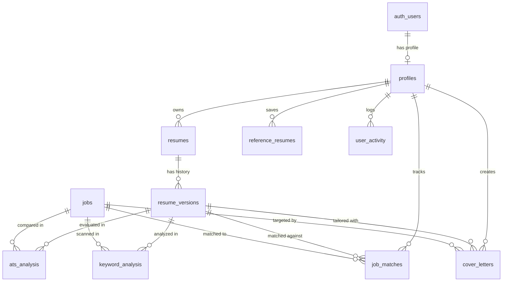

# JobWink - Complete Database Architecture Documentation

## Overview
This document serves as the formal technical documentation for the production database architecture of **JobWink**, built on **Supabase PostgreSQL**.

The schema defines **10 core tables**, complete with UUID primary keys, foreign key cascading constraints, vector embedding search indexes, automated triggers, and Row Level Security (RLS) policies.

---

## Technical Stack & Extensions
- **DBMS**: PostgreSQL 15+ (Supabase Managed)
- **Extensions**:
  - `uuid-ossp`: UUID primary key utilities.
  - `vector`: 768-dimensional vector embeddings search (`IVFFlat` cosine distance).
  - `pg_trgm`: Trigram matching for high-performance fuzzy text searching.

---

## Entity Relationship (ER) Diagram



---

## Detailed Table Specifications

### 1. `public.profiles`
Links directly to Supabase Auth `auth.users` (1-to-1).
- `id` (`UUID`, PK, FK -> `auth.users.id` ON DELETE CASCADE)
- `email` (`TEXT`, NOT NULL)
- `full_name` (`TEXT`)
- `avatar_url` (`TEXT`)
- `phone` (`TEXT`)
- `location` (`TEXT`)
- `linkedin_url` (`TEXT`)
- `github_url` (`TEXT`)
- `created_at` (`TIMESTAMPTZ`, DEFAULT `NOW()`)
- `updated_at` (`TIMESTAMPTZ`, DEFAULT `NOW()`)

### 2. `public.resumes`
Root record for master resumes owned by a user.
- `id` (`UUID`, PK, DEFAULT `gen_random_uuid()`)
- `user_id` (`UUID`, NOT NULL, FK -> `profiles.id` ON DELETE CASCADE)
- `title` (`TEXT`, NOT NULL, DEFAULT `'Master Resume'`)
- `template_type` (`TEXT`, DEFAULT `'NATIONAL_ATS'`, CHECK IN `('NATIONAL_ATS', 'INTERNATIONAL_GLOBAL')`)
- `raw_file_path` (`TEXT`, Supabase storage path to uploaded document)
- `current_version_id` (`UUID`, FK -> `resume_versions.id` ON DELETE SET NULL, DEFERRABLE)
- `created_at` (`TIMESTAMPTZ`, DEFAULT `NOW()`)
- `updated_at` (`TIMESTAMPTZ`, DEFAULT `NOW()`)

### 3. `public.resume_versions`
Immutable version snapshots storing raw parsed and optimized resume JSONB documents.
- `id` (`UUID`, PK, DEFAULT `gen_random_uuid()`)
- `resume_id` (`UUID`, NOT NULL, FK -> `resumes.id` ON DELETE CASCADE)
- `user_id` (`UUID`, NOT NULL, FK -> `profiles.id` ON DELETE CASCADE)
- `version_number` (`INT`, NOT NULL, DEFAULT `1`)
- `parsed_content` (`JSONB`, NOT NULL, DEFAULT `'{}'`) - Raw extracted resume JSON
- `optimized_content` (`JSONB`, DEFAULT `'{}'`) - AI-enhanced/tailored resume JSON
- `change_summary` (`TEXT`)
- `created_at` (`TIMESTAMPTZ`, DEFAULT `NOW()`)
- `updated_at` (`TIMESTAMPTZ`, DEFAULT `NOW()`)
- **Constraint**: `UNIQUE (resume_id, version_number)`

### 4. `public.reference_resumes`
Target benchmark resumes uploaded or saved for AI comparison.
- `id` (`UUID`, PK, DEFAULT `gen_random_uuid()`)
- `user_id` (`UUID`, NOT NULL, FK -> `profiles.id` ON DELETE CASCADE)
- `title` (`TEXT`, NOT NULL)
- `target_role` (`TEXT`)
- `parsed_content` (`JSONB`, DEFAULT `'{}'`)
- `file_path` (`TEXT`)
- `created_at` (`TIMESTAMPTZ`, DEFAULT `NOW()`)
- `updated_at` (`TIMESTAMPTZ`, DEFAULT `NOW()`)

### 5. `public.ats_analysis`
Dedicated ATS scoring and breakdown for a resume version against an optional target job.
- `id` (`UUID`, PK, DEFAULT `gen_random_uuid()`)
- `user_id` (`UUID`, NOT NULL, FK -> `profiles.id` ON DELETE CASCADE)
- `resume_version_id` (`UUID`, FK -> `resume_versions.id` ON DELETE CASCADE)
- `job_id` (`UUID`, FK -> `jobs.id` ON DELETE SET NULL)
- `ats_score` (`INT`, NOT NULL, DEFAULT `0`, CHECK 0-100)
- `formatting_score` (`INT`, DEFAULT `0`, CHECK 0-100)
- `content_score` (`INT`, DEFAULT `0`, CHECK 0-100)
- `relevance_score` (`INT`, DEFAULT `0`, CHECK 0-100)
- `feedback` (`JSONB`, DEFAULT `'{}'`) - Detailed section-by-section ATS suggestions
- `created_at` (`TIMESTAMPTZ`, DEFAULT `NOW()`)
- `updated_at` (`TIMESTAMPTZ`, DEFAULT `NOW()`)

### 6. `public.keyword_analysis`
Detailed keyword density, matching skills, and missing keyword gaps.
- `id` (`UUID`, PK, DEFAULT `gen_random_uuid()`)
- `user_id` (`UUID`, NOT NULL, FK -> `profiles.id` ON DELETE CASCADE)
- `resume_version_id` (`UUID`, FK -> `resume_versions.id` ON DELETE CASCADE)
- `job_id` (`UUID`, FK -> `jobs.id` ON DELETE SET NULL)
- `extracted_skills` (`TEXT[]`, DEFAULT `'{}'`)
- `matching_keywords` (`TEXT[]`, DEFAULT `'{}'`)
- `missing_keywords` (`TEXT[]`, DEFAULT `'{}'`)
- `keyword_density` (`JSONB`, DEFAULT `'{}'`)
- `created_at` (`TIMESTAMPTZ`, DEFAULT `NOW()`)
- `updated_at` (`TIMESTAMPTZ`, DEFAULT `NOW()`)

### 7. `public.jobs`
Global repository of scraped and aggregated job postings.
- `id` (`UUID`, PK, DEFAULT `gen_random_uuid()`)
- `external_job_id` (`TEXT`, UNIQUE)
- `job_title` (`TEXT`, NOT NULL)
- `company_name` (`TEXT`, NOT NULL)
- `company_logo_url` (`TEXT`)
- `location` (`TEXT`, DEFAULT `'Remote'`)
- `salary_range` (`TEXT`, DEFAULT `'Competitive'`)
- `platform_source` (`TEXT`, NOT NULL) - e.g. `'Wellfound'`, `'Indeed'`, `'Naukri'`, `'LinkedIn'`
- `job_url` (`TEXT`)
- `description` (`TEXT`, NOT NULL)
- `required_skills` (`TEXT[]`, DEFAULT `'{}'`)
- `embedding` (`VECTOR(768)`) - Gemini `text-embedding-004` vector
- `is_active` (`BOOLEAN`, NOT NULL, DEFAULT `TRUE`)
- `posted_at` (`TIMESTAMPTZ`, DEFAULT `NOW()`)
- `created_at` (`TIMESTAMPTZ`, DEFAULT `NOW()`)
- `updated_at` (`TIMESTAMPTZ`, DEFAULT `NOW()`)

### 8. `public.job_matches`
User-specific job matches, swipe states, and application Kanban tracking.
- `id` (`UUID`, PK, DEFAULT `gen_random_uuid()`)
- `user_id` (`UUID`, NOT NULL, FK -> `profiles.id` ON DELETE CASCADE)
- `resume_version_id` (`UUID`, FK -> `resume_versions.id` ON DELETE CASCADE)
- `job_id` (`UUID`, NOT NULL, FK -> `jobs.id` ON DELETE CASCADE)
- `match_percentage` (`NUMERIC(5,2)`, NOT NULL, DEFAULT `0.00`, CHECK 0.00 - 100.00)
- `status` (`TEXT`, NOT NULL, DEFAULT `'DISCOVERED'`, CHECK IN `('DISCOVERED', 'SAVED', 'PASSED', 'APPLIED', 'INTERVIEWING', 'OFFER', 'REJECTED')`)
- `matching_skills` (`TEXT[]`, DEFAULT `'{}'`)
- `missing_skills` (`TEXT[]`, DEFAULT `'{}'`)
- `notes` (`TEXT`)
- `scanned_at` (`TIMESTAMPTZ`, DEFAULT `NOW()`)
- `created_at` (`TIMESTAMPTZ`, DEFAULT `NOW()`)
- `updated_at` (`TIMESTAMPTZ`, DEFAULT `NOW()`)
- **Constraint**: `UNIQUE (user_id, job_id)`

### 9. `public.cover_letters`
AI-generated cover letters tailored to specific job postings.
- `id` (`UUID`, PK, DEFAULT `gen_random_uuid()`)
- `user_id` (`UUID`, NOT NULL, FK -> `profiles.id` ON DELETE CASCADE)
- `job_id` (`UUID`, FK -> `jobs.id` ON DELETE SET NULL)
- `resume_version_id` (`UUID`, FK -> `resume_versions.id` ON DELETE SET NULL)
- `title` (`TEXT`, NOT NULL)
- `content` (`TEXT`, NOT NULL)
- `tone` (`TEXT`, NOT NULL, DEFAULT `'Professional'`)
- `created_at` (`TIMESTAMPTZ`, DEFAULT `NOW()`)
- `updated_at` (`TIMESTAMPTZ`, DEFAULT `NOW()`)

### 10. `public.user_activity`
Audit trail of user interactions, swipe actions, and AI generations.
- `id` (`UUID`, PK, DEFAULT `gen_random_uuid()`)
- `user_id` (`UUID`, NOT NULL, FK -> `profiles.id` ON DELETE CASCADE)
- `activity_type` (`TEXT`, NOT NULL) - e.g. `'RESUME_PARSED'`, `'RESUME_TAILORED'`, `'JOB_SWIPED'`, `'APPLICATION_MOVED'`
- `metadata` (`JSONB`, DEFAULT `'{}'`)
- `created_at` (`TIMESTAMPTZ`, DEFAULT `NOW()`)

---

## Security Policy (RLS) Matrix

| Table Name | RLS Enabled | Policies Applied |
| :--- | :--- | :--- |
| `profiles` | YES | `auth.uid() = id` (SELECT, UPDATE) |
| `resumes` | YES | `auth.uid() = user_id` (ALL) |
| `resume_versions` | YES | `auth.uid() = user_id` (ALL) |
| `reference_resumes` | YES | `auth.uid() = user_id` (ALL) |
| `ats_analysis` | YES | `auth.uid() = user_id` (ALL) |
| `keyword_analysis` | YES | `auth.uid() = user_id` (ALL) |
| `jobs` | YES | `auth.role() = 'authenticated' AND is_active = TRUE` (SELECT) |
| `job_matches` | YES | `auth.uid() = user_id` (ALL) |
| `cover_letters` | YES | `auth.uid() = user_id` (ALL) |
| `user_activity` | YES | `auth.uid() = user_id` (SELECT, INSERT) |

---

## Storage Buckets Specification

The application uses **4 private Supabase Storage buckets** with strict user-folder security policies:

| Bucket Name | Access Level | Max Size | Allowed MIME Types | Access Policy |
| :--- | :--- | :--- | :--- | :--- |
| `resumes` | Private | 10 MB | `.pdf`, `.docx`, `.doc` | Authenticated users can only read/write files under `resumes/{user_id}/*` |
| `optimized-resumes` | Private | 10 MB | `.pdf` | Authenticated users can only read/write files under `optimized-resumes/{user_id}/*` |
| `reference-resumes` | Private (Backend Only) | 10 MB | `.pdf`, `.docx`, `.doc` | Restricted; no public user RLS policy (accessible strictly via Service Role) |
| `cover-letters` | Private | 10 MB | `.pdf`, `.txt` | Authenticated users can only read/write files under `cover-letters/{user_id}/*` |

---

## Deployment & Migration Instructions

To deploy migrations to your live Supabase project using the Supabase CLI:

```bash
# 1. Link Supabase CLI to project
npx supabase link --project-ref YOUR_SUPABASE_REF

# 2. Push migrations to database
npx supabase db push
```

